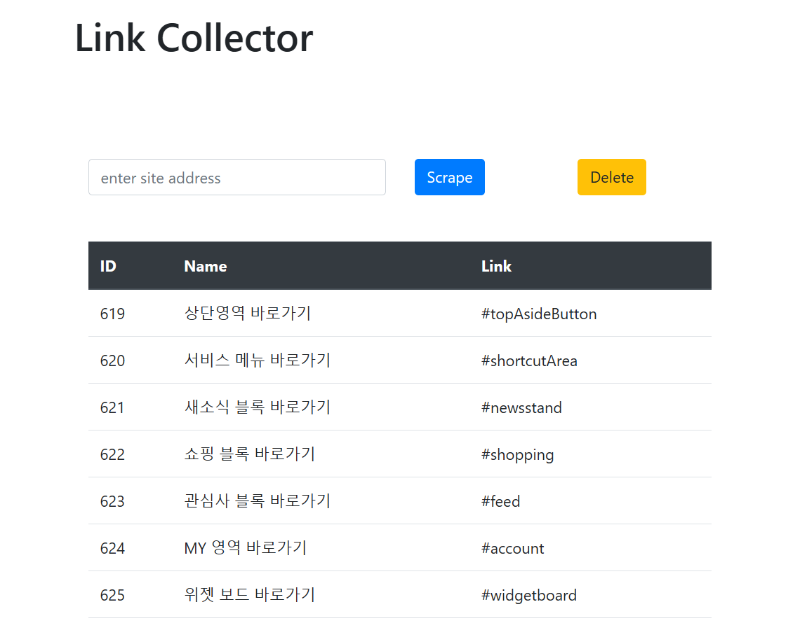
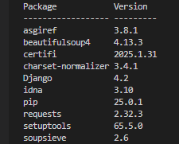
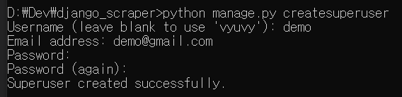
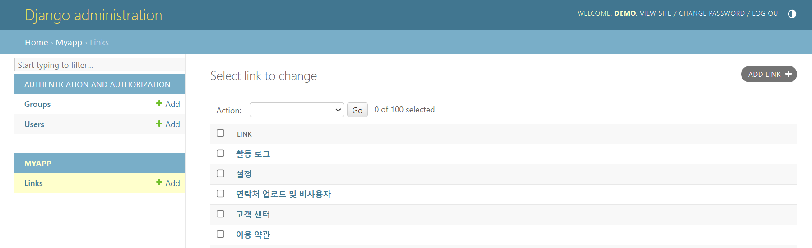
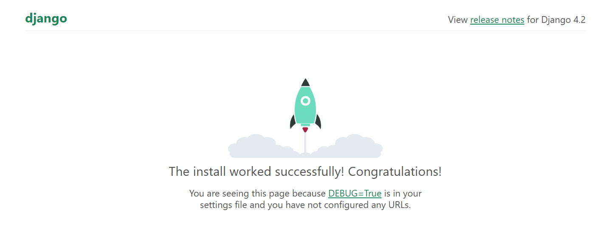
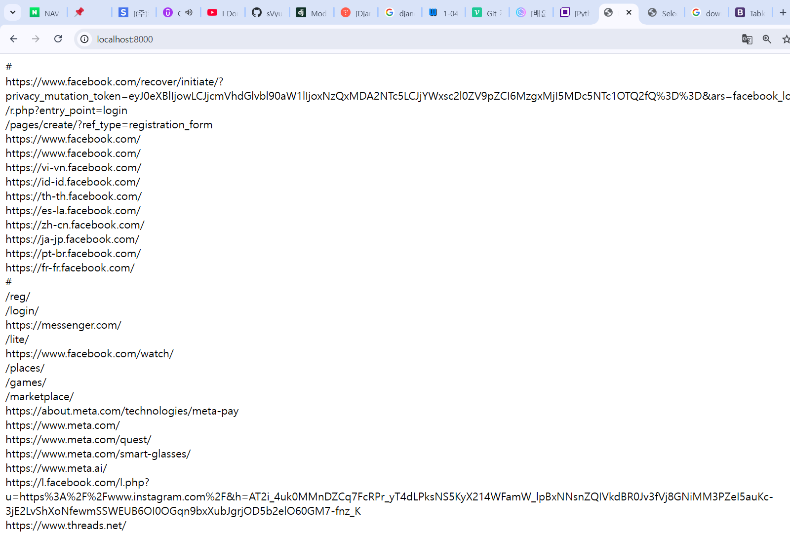
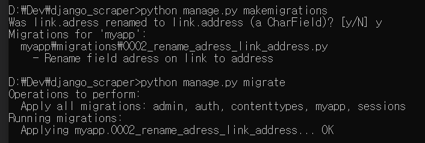
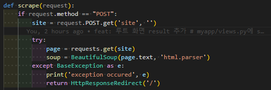

# django based web scraper/crawler project

<br/>
<br/>

# Package list & Version
<table align="center">
<tr>
<td>

</td>
<td>&nbsp;&nbsp;&nbsp;&nbsp;</td>
<td>
<p align="center">
<h3 align="center">DJango # 4.2</h3>
<h3 align="center">requests # 2.32.3</h3>
<h3 align="center">beautifulsoup4 # 4.13.3</h3>
<p>
</td>
</tr>
</table>
<br/>
<br/>

# 최종 화면


## 프로젝트 실행
```shell
python manage.py runserver
```

<details>
<summary>cmd 창 주요 명령어들</summary>

- project 생성 : `django-admin startproject config`
- app 생성 : `django-admin startapp myapp`
- model 수정 : `python manage.py makemigrations`
- db에 반영 : `python manage.py migrate`
- superuser 생성 : `python manage.py createsuperuser`
</details>
<br>
<br>


# superuser cmd 및 administration 페이지
<p align="center">


</p>


# 개발 과정 capture


<br/>
<br/>


# error handling
> &nbsp; (1) adress -> address 수정 및 re-migrate


> &nbsp;(2) POST 요청에 대해서 try-catch 추가 # 비정상적인 url 요청 등에 대한 대비

<br/>
<br/>


# ref
- <a target="_blank" href="https://www.udemy.com/course/django-course/">Django Masterclass : Build 9 Real World Django Projects</a>
- <a target="_blank" href="https://wikidocs.net/72377">점프 투 장고 - 장고 프로젝트 생성하기</a><br/><br/>
- <a target="_blank" href="https://docs.djangoproject.com/en/5.1/ref/databases/#sqlite-notes">Django docs # supports SQLite 3.31.0 and later</a>
- <a target="_blank" href="https://docs.djangoproject.com/en/5.1/topics/db/models/">Django docs # models</a>
- <a target="_blank" href="https://docs.djangoproject.com/en/5.1/topics/migrations/">Django docs # migrations</a><br/><br/>
- <a target="_blank" href="https://chagokx2.tistory.com/49">req POST -> </a>
- <a target="_blank" href="https://docs.python.org/ko/3.13/library/exceptions.html">BaseExecption (python)</a>

